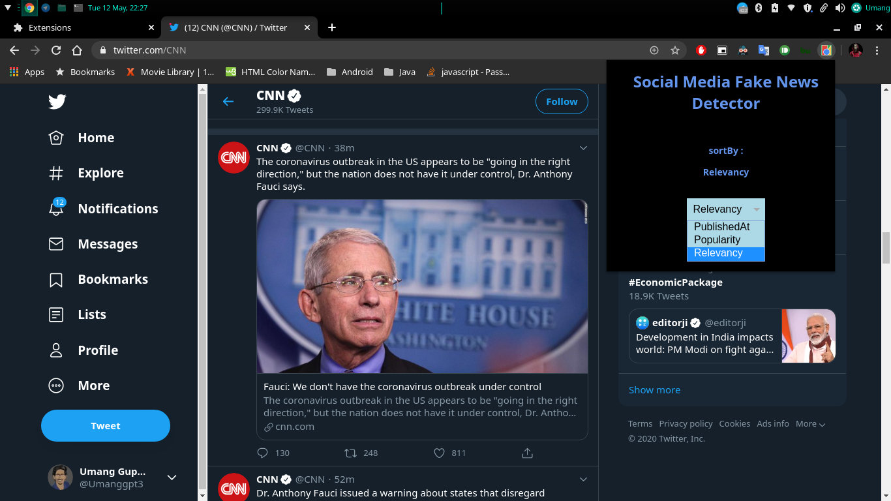

Mini-Project
# Social Media Fake News Detection Helper
- A chrome plugin using which you can get relevant news articles for the selected text on social media websites.
- It makes use of JavaScript, Django and Python libraries like Nltk.
- It shows a similarity percentage between the social media post and genuine news articles to help users identify fake news.

# Screenshots
## Extension UI

## Relevant articles based on popularity

## Relevant articles based on publishedAt

## Relevant articles based on relevancy

